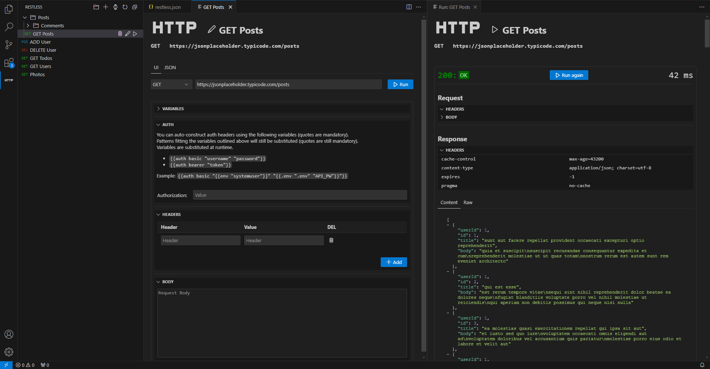

# RESTless HTTP / REST Client VSCode Extension

RESTless is a Visual Studio Code extension which integrates an HTTP client into VSCode. It features a GUI for editing the requests as well as running them.

It also supports externally sourced variables for high flexibility and keeping secrets out of your codebase.



## Features

- Support for Methods, Headers, [Authentication](#authentication) and request bodies
- Highly flexible [variable](#variables) substitution system
- Saves your configured HTTP calls to the workspace so you can share your tests
- Neatly arranged in a nested, browsable tree structure with drag-and-drop reordering
- View response as dynamic (collapsible) JSON structure or rendered HTML where applicable; view raw if you want to
- 1 "temporary" call, which does not get saved to the workspace list and is synced between your VSCcode instances (open via button on top of call list)

## Variables

Every text input accepts variables in a special format. This way you can populate request options with information read from files or the environment, thus enabling you to keep secrets out of your codebase.

Variables are substituted when running the call an currently, the following are supported: 
- `{{file "relative/path.file"}}`: substitute with entire content of a file
- `{{env "variable"}}`: subsitute with environment variable
- `{{.env "relative/path.file" "variable"}}`: substitute with variable read from given `.env`file

These variables can also be nested - for example, one may have a file path as a variable in a `.env` file:
```
{{file "{{.env "settings.env" "file"}}"}}
```

Variable parameters are *delimited* by double quotes and therefore currently cannot contain double quotes in the values (in some circumstances).

## Authentication

Authentication supports additional special "variables" which construct appropriate headers on runtime:

- `{{auth basic "username" "password"}}`
- `{{auth bearer "token"}}`

Again, these can contain regular variables as outlined above.
